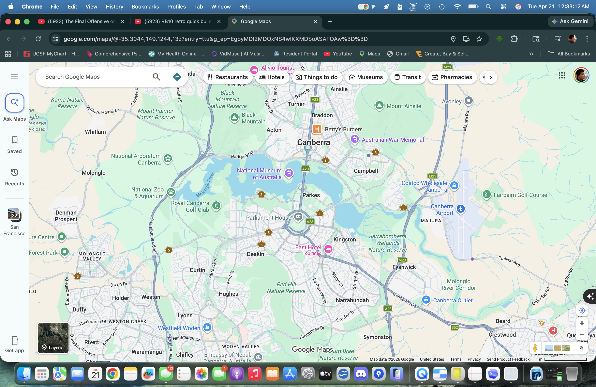
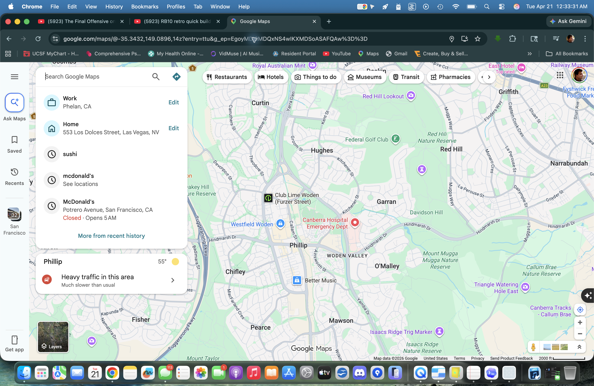
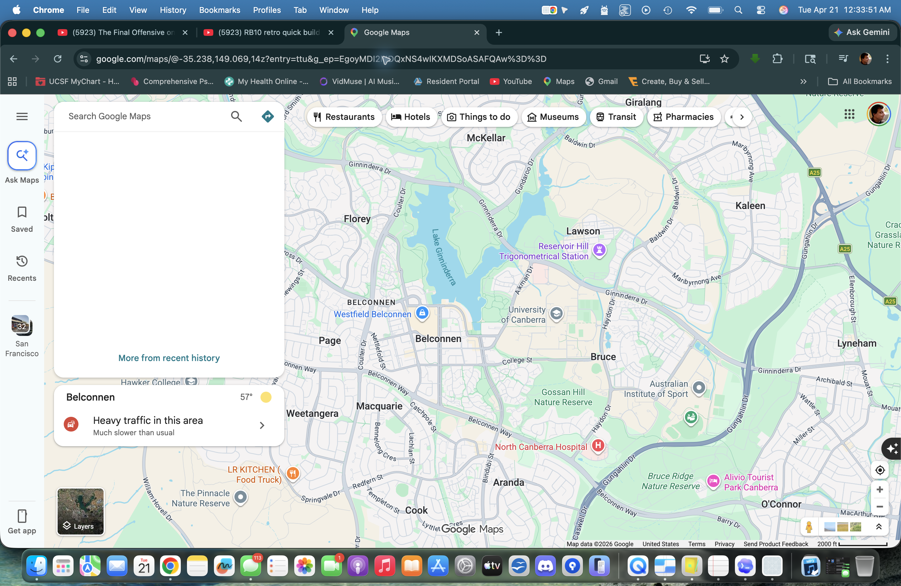
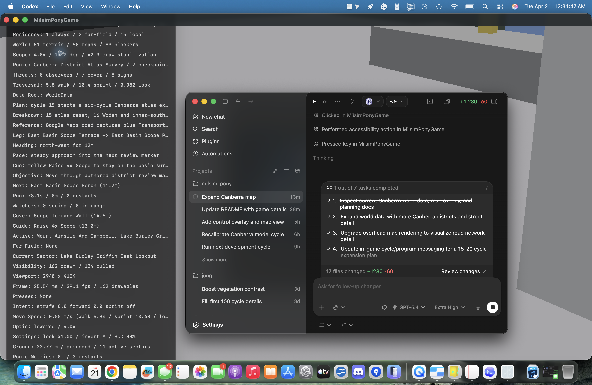
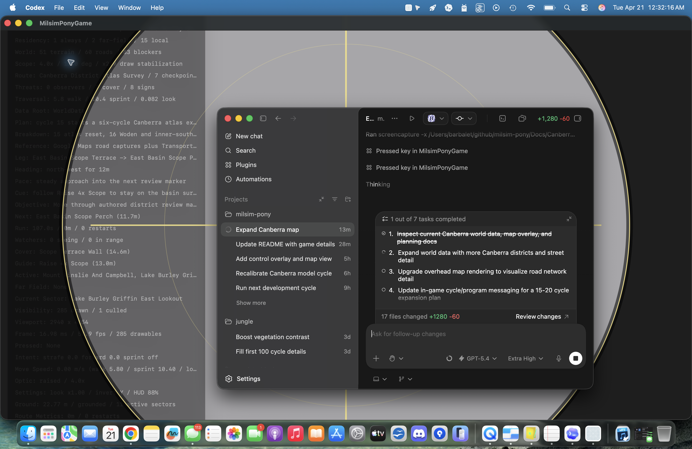
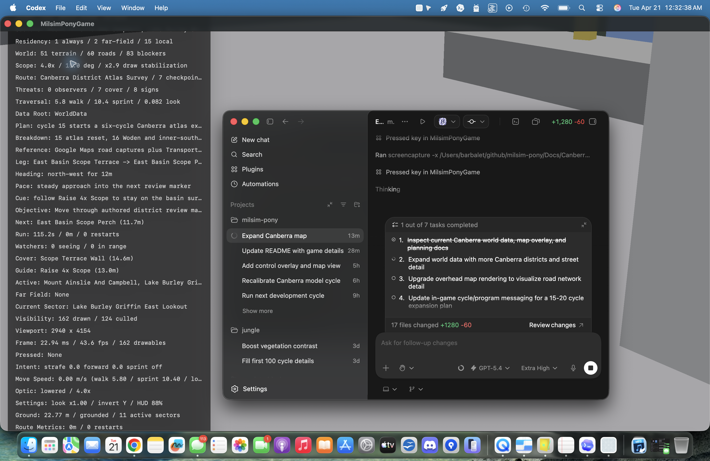

# Canberra Reference Gallery

Locked on `2026-04-22` for the cycle `21` Canberra combat-lane rehearsal baseline.

## Adequacy Check

- Google Maps captures now anchor the Woden, central basin, and Belconnen halves of the live Woden-to-Belconnen route.
- That is adequate for the cycle `21` combat rehearsal because every major district stop can now point at an existing source family plus a live contact-lane frame in-game.
- It is still not a full-city combat reference set. Future gallery updates should add dedicated west-basin, Black Mountain, Barton-Russell, and Mount Ainslie closeups before a heavier combat build.

## Google Maps Road Atlas Captures

### Central Canberra

Source:
[Google Maps central Canberra](https://www.google.com/maps/@-35.3044,149.1244,13z)

Focus:
Lake Burley Griffin, Parliament House, Civic, Campbell, and the airport/east-basin side of the basin.

### Woden

Source:
[Google Maps Woden](https://www.google.com/maps/@-35.3432,149.0896,14z)

Focus:
Woden Valley, Westfield Woden, Hindmarsh Drive, Melrose Drive, Yamba Drive, Garran, and Hughes.

### Belconnen

Source:
[Google Maps Belconnen](https://www.google.com/maps/@-35.2380,149.0690,14z)

Focus:
Belconnen Town Centre, Westfield Belconnen, Emu Bank, Bruce, UC, and the northern lake edge.

## In-Game Reference Captures

Build source:
`/tmp/MilsimPonyDerived/Build/Products/Debug/MilsimPonyGame.app`

### Atlas Map Overlay

Focus:
The upgraded overhead map showing `18` Canberra sectors and `60` named road strips.

### Scope Overlay

Focus:
Live scoped review mode carried forward into the cycle `21` contact rehearsal.

### Pause Shell

Focus:
The updated review shell and district-atlas route framing.

## Cycle 21 Route Coverage

- Woden and State Circle use the Woden atlas capture plus ACT transport guides as the southern anchor for the first live contact lanes.
- East Basin, Barton-Russell, Civic, and West Basin use the central Canberra atlas capture as the basin-core source for the active rehearsal route.
- Black Mountain, Belconnen Town Centre, and Ginninderra use the Belconnen atlas capture plus regional guides as the north-west source for the closing contact lanes.

## Supporting Planning Sources

- [Transport Canberra region maps and guides](https://www.transport.act.gov.au/getting-around/find-a-stop-or-map)
- [Woden, Weston Creek and Molonglo guide](https://www.transport.act.gov.au/getting-around/regional-guides/woden%2C-weston-creek-and-molonglo)
- [Belconnen guide](https://www.transport.act.gov.au/getting-around/regional-guides/belconnen)
- [Lake Burley Griffin overview](https://www.nca.gov.au/attractions/lake-burley-griffin)
