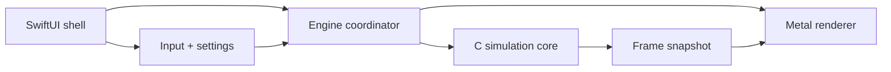

# Jungle architecture

This document captures the cycle 2 output: the boundary between the SwiftUI shell, the Metal renderer and the C simulation core.

## Goals

* Keep the simulation deterministic and portable by concentrating world state in C.
* Keep rendering Metal-focused so GPU work can evolve without contaminating gameplay logic.
* Keep SwiftUI responsible for the Mac app experience, debug tools and system integration.
* Pass immutable frame data from simulation to renderer so ownership stays simple.
* Make it possible to test the simulation core without the renderer or UI attached.

## Module map



## Module responsibilities

### SwiftUI shell

The SwiftUI shell is the Mac application layer.

* Own app lifecycle, windows, menus and settings surfaces.
* Host the Metal-backed view and debug overlays.
* Translate keyboard, mouse and controller input into engine commands.
* Store user preferences such as quality mode, inversion and sensitivity.
* Present non-simulation UI such as benchmark panels and review presets.
* Never own terrain generation, ape simulation or raw Metal draw logic.

### Engine coordinator

The engine coordinator is a thin Swift layer that sits between SwiftUI and the lower-level modules.

* Start up and shut down the C core and Metal renderer in the right order.
* Convert app input into a stable command packet for the simulation step.
* Advance the simulation on the chosen timing policy once cycle 5 defines it.
* Request an immutable frame snapshot from the C core after each update.
* Hand the snapshot plus render settings to the Metal renderer for drawing.
* Keep coordination logic out of SwiftUI views and out of the C simulation code.

### C simulation core

The C simulation core is the authoritative world model.

* Own seeds, world state, biome state, weather state and ape state.
* Generate procedural terrain, foliage placement inputs and environmental parameters.
* Maintain deterministic update rules for movement, spawning and animation drivers.
* Provide collision, visibility inputs, time-of-day values and water-state values.
* Expose plain C data structures and functions that Swift can call safely.
* Never depend on SwiftUI, Metal, Objective-C runtime behavior or Apple UI frameworks.

### Metal renderer

The Metal renderer is the GPU-facing presentation layer.

* Own the `MTLDevice`, command queue, pipeline states, buffers and textures.
* Convert frame snapshots into draw submissions for terrain, foliage, water, sky and apes.
* Manage instancing, culling inputs, material bindings and frame synchronization.
* Apply visual quality settings, debug visualizations and capture hooks.
* Never mutate simulation state directly.
* Never become the source of truth for gameplay, biome or weather logic.

## Ownership rules

* The C core owns mutable world state.
* The renderer owns GPU resources.
* SwiftUI owns user intent and application presentation state.
* Shared data crosses module boundaries as copied or read-only snapshot structures.
* The renderer can cache derived GPU data, but that cache must be rebuildable from snapshots.
* The UI can request debug views, but debug state that affects simulation must flow through the coordinator into the core.

## Data flow per frame

1. SwiftUI gathers current input and display settings.
2. The engine coordinator converts that state into a compact command packet.
3. The coordinator advances the C core by one simulation step.
4. The C core emits a frame snapshot containing camera, environment and instance data.
5. The coordinator passes the snapshot to the Metal renderer.
6. The renderer records draw commands and presents the frame.
7. SwiftUI overlays any debug or settings UI on top of the Metal view.

## Initial interface plan

The exact names can move during implementation, but the boundary should stay close to this shape.

### C core API surface

```c
typedef struct jungle_engine jungle_engine;
typedef struct jungle_engine_config jungle_engine_config;
typedef struct jungle_input_state jungle_input_state;
typedef struct jungle_frame_snapshot jungle_frame_snapshot;

jungle_engine *jungle_engine_create(const jungle_engine_config *config);
void jungle_engine_destroy(jungle_engine *engine);
void jungle_engine_step(
    jungle_engine *engine,
    const jungle_input_state *input,
    double delta_seconds
);
void jungle_engine_snapshot_copy(
    const jungle_engine *engine,
    jungle_frame_snapshot *out_snapshot
);
```

### Snapshot contents

Each frame snapshot should be plain data only.

* Camera transform and projection inputs.
* Time-of-day and weather parameters.
* Terrain patch descriptors.
* Foliage instance descriptors grouped by biome and layer.
* Water surface descriptors for shallow and deep regions.
* Ape instance descriptors including pose drivers and material variants.
* Debug counters needed by the HUD.

### Swift-side coordination types

The Swift layer should wrap the C API and isolate SwiftUI from raw pointers.

* `JungleEngineCoordinator` manages stepping and snapshot handoff.
* `JungleInputMapper` turns macOS input events into `jungle_input_state`.
* `JungleRenderSettings` carries quality and debug toggles to the renderer.
* `JungleMetalView` hosts the renderer inside SwiftUI.

## Planned repository layout

This layout is the target for cycle 3 when project scaffolding begins.

* `Sources/App/` for SwiftUI app entry, settings UI and coordinator code.
* `Sources/Renderer/` for Metal view integration, shaders and renderer code.
* `Sources/Core/` for C headers, source files and simulation data structures.
* `Sources/Shared/` for cross-module constants and snapshot definitions if needed.
* `Tests/CoreTests/` for deterministic simulation tests.
* `Tests/AppTests/` for lightweight integration coverage where appropriate.

## Boundary checks

These rules are the quickest way to catch architectural drift.

* If a file imports SwiftUI, it should not also contain procedural world generation.
* If a file owns `MTLRenderCommandEncoder`, it should not decide ape behavior or weather transitions.
* If a C file needs Cocoa or SwiftUI types, the boundary has been crossed incorrectly.
* If the renderer requires mutable access to world state, the snapshot contract is too weak.
* If UI code reaches into raw C structures broadly, the coordinator wrapper is too thin.

## Next cycle

Cycle 19 should add the first shallow-water prototype on top of the current grassland, jungle, and beach terrain foundation.
